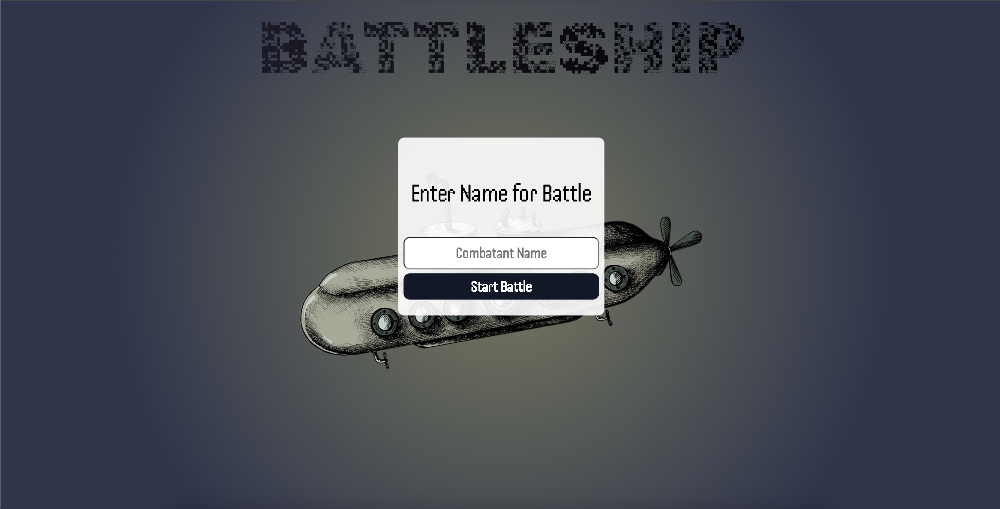
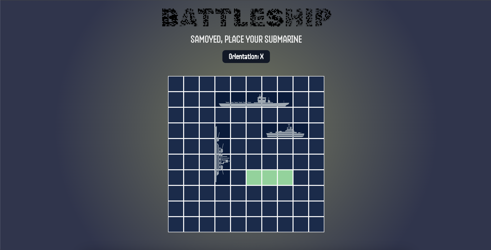
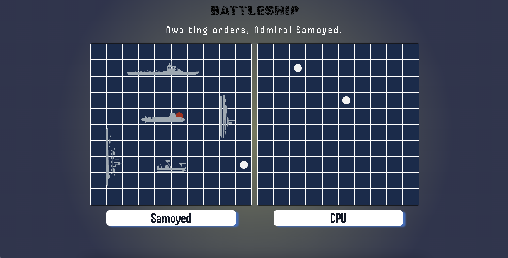

## Table of Contents

- [Project Description](#project-description)
- [How to Play](#how-to-play)
- [Credits](#credits)
- [Bug Fix Plans](#bug-fix-plans)

# Project: Battleship

This project implements the classic game "Battleship" using JavaScript, HTML, and CSS. Inspired by The Odin Project’s open-source course, it focuses on applying object-oriented programming principles and creating a complex UI with CSS animations and transitions.

The game allows users to play against the computer. The objective is to sink all the opponent's ships. The game includes a replay option once a player wins.

The project emphasizes the use of Test Driven Development (TDD), with Jest used for testing the `setName` module as of 09/15/2024.

An explanation of Battleship, in which I used to implement the game flow logic, can be found here: https://en.wikipedia.org/wiki/Battleship_(game)

## Project Description

This project allows the user to play a game of Battleship with the computer. The game continues until one player's ships have all sunk, in which case the user is asked whether to replay the game.

The most central aim of this project was to implement object-oriented programming to facilitate the game and to create a more complex UI via CSS properties, in particular, CSS animation-transition properties.
Another important goal was to practice Test Driven Development. As of now (09/15/2024), I used Jest to test for the setName module.

## How to play

1. The user will be prompted to enter a name.
   

2. Then, the user will be able to place ships on the board either horizontally or vertically.
   

3. Finally, the game begins, with the user and the cpu taking turns to attack each other.
   

## Credits

### Fonts

- **Logo Font:** Rubik Pixel  
  [Rubik Pixel on Google Fonts](https://fonts.google.com/share?selection.family=Rubik+Pixels)
- **Body Font:** Handjet  
  [Handjet on Google Fonts](https://fonts.google.com/share?selection.family=Handjet:wght@100..900)

### Assets

- **Submarine Art:**  
  [Freepik Submarine Art](https://www.freepik.com/free-vector/hand-drawn-retro-submarine_2783078.htm#fromView=search&page=1&position=28&uuid=2cf158bf-c18e-47f1-b34b-284020cfa226)

- **Ship Icons:**  
  [Freepik Ship Icons](https://www.freepik.com/icon/cruiser_11434227#fromView=families&page=1&position=0&uuid=5555eca2-7ee1-4986-a03f-9119eeb7bf90)

## Bug Fix Plans

- **SVG Formatting Issues:**  
  The current SVG formatting on the game board is suboptimal, causing some icons to overlap the grid. I plan to adjust the SVG sizes and positioning to ensure they fit properly within the grid cells.

- **Enhanced Computer AI:**  
  Currently, the computer makes random attacks. Future updates will improve the AI to make consecutive attacks when a hit is detected, increasing the strategic depth of the game.
